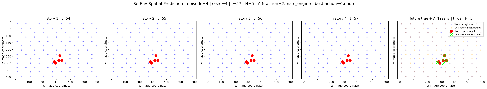

# Action Inference

This project explores action inference from video without starting from human-defined action labels such as "walking", "standing", or "flying".

The core idea is to define an action mathematically as the dynamics of objects over time.

## Current Handoff

The current working branch of the project has moved from generic object/action notes into a concrete Lunar Lander action-embedding pretraining experiment.

The main working idea is:

```text
video frame -> control points -> background points -> CP/background relation -> action embedding token
```

For one object in frame `t`, the control points are represented as:

```text
P_t in R^{K x 2}
```

where `K` is the number of control points. In the Lunar Lander experiment, these are geometry-derived points such as centroid, axis points, and contact-like points. The background is represented as selected tracked background points:

```text
B_t in R^{N x 4}
```

where each background point stores image coordinates and optical-flow displacement:

```text
[x, y, dx, dy]
```

The action embedding is currently defined as a multiplicative CP/background relation. For x and y coordinates:

```text
A_t^x = X_cp,t @ X_bckg,t.T
A_t^y = Y_cp,t @ Y_bckg,t.T
A_t = stack(A_t^x, A_t^y) in R^{K x N x 2}
```

This is an outer product, not a dot product. With `K = 6`, `N = 100`, and two relation channels, each flattened action token has:

```text
D = K * N * 2 = 1200
```

The transformer pretraining task is:

```text
z_{t-L+1:t} -> z_{t+1}
```

where `z_t = flatten(A_t_norm)`. This part works as a baseline: the model can learn temporal dynamics of CP/background action embeddings on Lunar Lander episodes.

### What Worked

- Built control point extraction for Lunar Lander from segmented blobs.
- Built background surface grid tracking.
- Reduced background points to a fixed `N = 100` selected points per frame.
- Built action embeddings from CP/background outer products.
- Normalized action embeddings and trained a small causal transformer to predict the next action embedding.
- Modularized the pretraining pipeline under `src/pretraining/`.
- Added notebook-scale artifacts under `notebooks/artifacts/` and production-style pretraining artifacts under `artifacts/pretrain/`.

### Pretraining Result

The pretraining experiment treats each normalized CP/background relation as one transformer token. The model sees a short history of action-embedding tokens and predicts the next token:

```text
z_{t-L+1}, ..., z_t -> z_{t+1}
```

This is not yet a policy. It is a motion-representation pretrain. The goal is to teach the model what local object-background motion looks like before mapping that motion into a specific robot or simulator action space.

Pretraining artifacts are produced by the modular pipeline in `src/pretraining/` and written under `artifacts/pretrain/`. The current local run used Lunar Lander episodes, `K = 6` control points, `N = 100` selected background points, two relation channels, and flattened token dimension `D = 1200`.


The spatial reconstruction view is only an approximate visualization of the flattened relation token, but it is useful as a sanity check: the predicted relation stays close enough to the true next relation to show that the transformer is learning temporal structure.


### Fine-Tuning Bottleneck

The unresolved problem is mapping learned action embeddings into an executable agent action space.

The desired inference path is:

```text
history frames -> CP/background -> action embeddings -> transformer -> predicted action embedding -> action interface
```

For Lunar Lander, the action interface is discrete:

```text
noop, left_engine, main_engine, right_engine
```

The difficult part is that the action embedding describes motion, but it is not automatically grounded to an agent-specific action command. A direct network:

```text
action_embedding_dim -> action_space_dim
```

needs a learning signal. If expert action labels are not used, the only tested signal so far is a re-environment benchmark: try candidate actions in a simulator, encode their resulting frame back into CP/background relation space, and choose the action whose consequence is closest to the reference relation.

This produced some signal, but it also exposed a major issue: closed-loop re-env training drifts away from the reference trajectory when the model is still weak. Once the re-env state diverges or crashes, comparison to the original pretrain episode becomes noisy or invalid.

The better next fine-tune direction is likely teacher-forced re-env grounding:

```text
replay reference trajectory to t -> test each candidate action locally -> compare t+H relation deltas -> train action head on the best candidate
```

This avoids letting an untrained policy destroy the trajectory before useful labels are generated.

### Fine-Tuning Experiment

The current fine-tune notebook explores an Action Inference Net:

```text
predicted action embedding -> Lunar Lander action logits
```

For Lunar Lander, the executable action interface is:

```text
0: noop
1: left_engine
2: main_engine
3: right_engine
```

The fine-tune test used a re-environment benchmark. For each candidate action, the environment is replayed, the candidate action is applied, the resulting frame is encoded back into CP/background relation space, and the candidate whose consequence is closest to the reference relation is treated as the benchmark action. The more stable version compares horizon deltas instead of absolute next-frame relations:

```text
delta_true = A_true(t+H) - A_true(t)
delta_candidate = A_reenv_candidate(t+H) - A_reenv(t)
best_action = argmin MSE(delta_candidate, delta_true)
```

The latest fine-tune trace contains `8940` steps, `8` Lunar Lander episodes, horizon `H = 5`, input dimension `1200`, action-space output dimension `4`, and cross-entropy training against the re-env benchmark action.


The model showed a learning signal, but the action distribution and confusion matrix also show a strong bias toward `main_engine`. This is expected at this stage because Lunar Lander has many visually similar short-horizon states, and several candidate actions often produce almost indistinguishable CP/background deltas.


The candidate margin plot is the key diagnostic. Most candidate losses are very close to each other, which means the benchmark often has low confidence. In those cases, the chosen action can be almost arbitrary even if the math is correct.


The re-env spatial view confirms that the loop can generate interpretable candidate consequences, but it also makes the central bottleneck visible: small action differences can be hard to separate from CP/background relation alone over a short horizon.



### Current Research Conclusion

The pretraining representation is promising. The fine-tuning/action grounding step is the real bottleneck.

The most likely next directions are:

- keep the CP/background action embedding pretrain,
- improve spatial structure instead of flattening everything too early,
- add explicit spatial embeddings for control point index, background point index, channel, and time,
- test teacher-forced re-env fine-tuning instead of closed-loop re-env fine-tuning,
- consider a semantic bridge such as motion words or a pretrained visual model to map embeddings into interpretable action concepts,
- only then map those concepts into a concrete agent action space.

### Next Plan

The next chat should not restart from object detection. The useful state is:

```text
pretrain action embeddings are valid enough for continued research
fine-tune action grounding is the open problem
```

The next practical steps are:

1. Rebuild fine-tuning as teacher-forced re-env grounding instead of closed-loop drift.
2. Add confidence filtering using candidate loss margin, so low-margin pseudo-actions are ignored or downweighted.
3. Test longer action-effect horizons and frame stride because single-frame CP/background differences are often too small.
4. Replace pure flattened tokens with a spatially structured transformer input using control-point index, background-point index, relation-channel, and temporal position embeddings.
5. Consider a semantic action bottleneck such as motion words: `move_left`, `move_right`, `stabilize`, `falling`, `slow_down`, `rotate_left`, `rotate_right`.
6. Later, test whether pretrained visual encoders such as DINOv2, CLIP/SigLIP, or a VLM teacher can provide missing scene semantics.

## Repository Layout

The repository is currently separated into code, notebooks, and local artifacts:

```text
src/
  pretraining/      # modular action-embedding pretraining pipeline

notebooks/
  Action_Inference_Experiments_Object_and_Background_Segmentation_Model_Selection.ipynb
  Action_Inference_Experiments_LunarLander_Single_Episode_Action_Encoder_on_Transformer.ipynb
  Action_inference_Experiments_LunarLander_Pretraining.ipynb
  Action_Inference_Experiments_LunarLander_FineTune.ipynb

artifacts/
  raw_videos/      # source videos used by research and pretraining
  research/        # exploratory outputs from earlier notebook experiments
  pretrain/        # generated pretraining datasets, plots, logs, and models

lunarlander_expert/
  # expert policy/video generation code for Lunar Lander
```

Large generated data is intentionally ignored by git, including `artifacts/pretrain/`,
`artifacts/research/`, `artifacts/raw_videos/`, expert videos, local model weights,
and media files. The repo should track code, notebooks, and documentation, not
multi-GB CSV/video artifacts.

### Pretraining Pipeline

The pretraining code lives in `src/pretraining/`. Run it from the project root:

```bash
python -m src.pretraining.run_control_points
python -m src.pretraining.run_background_points
python -m src.pretraining.run_action_embeddings
python -m src.pretraining.run_pretrain_transformer
```

The modular pipeline writes outputs to:

```text
artifacts/pretrain/
  control_points/
  background_points/
  action_embeddings/
  tokens/
  models/
  plots/
  logs/
  reviews/
```

Research artifacts from the earlier exploratory notebooks are kept separately:

```text
artifacts/research/
  control_points/
  background_points/
  segmentation_and_background/
  full_masked_movies/
```

## Hypothesis

An action is not a word label. An action is a structured transformation of objects across frames.

Given a video sequence:

```text
I_t, I_{t+1}, ..., I_{t+k}
```

we first identify objects, represent each object as a set of geometric points, and define the action as the temporal evolution of those points.

## Object Representation

For each object in a frame, we want a geometry-aware representation:

```text
O_t = {p_1^t, p_2^t, ..., p_n^t}
```

where points may include:

- object centroid
- bounding box corners
- contour points
- high-curvature points
- bend or joint-like points for deformable subparts
- optional skeleton or medial-axis points

The number and placement of points should depend on the object shape, not on a fixed human semantic label.

## Action Representation

An action is represented as the motion and deformation of object points over time:

```text
A_t = O_{t+1} - O_t
```

or, for a longer temporal window:

```text
A_{t:t+k} = trajectory({p_i^t})
```

Useful features may include:

- displacement
- velocity
- acceleration
- rotation
- scale change
- deformation
- contact changes between objects
- relative motion between objects

This makes the action a latent geometric-dynamic token rather than a manually named class.

## Learning Setup

The intended direction is self-supervised or unsupervised action inference:

1. Segment objects in each frame.
2. Convert each segmented object into a point-based representation.
3. Track points across time.
4. Encode point trajectories into latent action vectors.
5. Cluster or tokenize those vectors into reusable action primitives.
6. Optionally compare discovered action tokens against known environment actions for evaluation.

## Visual Problems

The project should progress through five visual problems with increasing difficulty. Each problem should test whether object geometry and point dynamics can recover meaningful latent actions.

### 1 - Lunar Lander

#### Problem

Infer the lander's latent action from simple rendered physics.

#### Plot

A lander moves through a 2D world under gravity, using left, main, and right engine impulses. The goal is to segment the lander, track its geometric points, and recover motion tokens that align with engine effects.

LunarLander is the first controlled testbed because it provides:

- rendered video frames
- known simulator state
- known discrete actions
- simple object geometry
- interpretable physical dynamics

The simulator actions are not the main representation. They are only used as a sanity-check signal.

Plan:

1. Run the environment using a heuristic policy.
2. Save frames, observations, rewards, and simulator actions.
3. Segment the lander from each frame.
4. Extract geometric points from the lander shape.
5. Track those points through time.
6. Build latent action vectors from point dynamics.
7. Check whether discovered motion tokens align with engine actions.

### 2 - Car Racing

#### Problem

Infer vehicle control from ego-object motion and track geometry.

#### Plot

A car moves on a 2D race track with steering, acceleration, and braking. The action representation should capture vehicle translation, rotation, speed changes, and position relative to the road boundary.

### 3 - Recorded Traffic With People

#### Problem

Infer human and vehicle motion primitives from a real recorded scene.

#### Plot

People and vehicles move through a real video scene. The action representation should capture detection geometry, object trajectories, pedestrian motion, vehicle motion, and relative motion between objects.

### 4 - Random YouTube Driving Scene

#### Problem

Infer traffic actions from a separate random 3-minute YouTube driving clip.

#### Plot

The clip is a driving scene with cars and road context. This problem is harder than the local simulator and the small recorded traffic sample because it uses a longer real-world video segment with more visual variation.

Video source:

- YouTube: https://www.youtube.com/watch?v=7EovwWQIvBo
- Local clip: `artifacts/raw_videos/problem_4_youtube_random.mp4`

### 5 - Hard Vehicle-Crowd Interaction

#### Problem

Infer actions in the hardest separate vehicle/crowd YouTube driving clip.

#### Plot

The clip is a longer and harder real-world driving scene with dense urban activity. It tests detection and action inference under more objects, more occlusion, changing scene layout, and harder vehicle/pedestrian interactions.

Video source:

- YouTube: https://www.youtube.com/watch?v=7HaJArMDKgI
- Local clip: `artifacts/raw_videos/problem_5_youtube_hardest.mp4`

## Object Detection

Each visual problem has a matching detection subsection in the notebook:

### 1 - Lunar Lander Detection

YOLO is run directly on LunarLander frames. The model decides what, if anything, it recognizes from its pretrained class set; no `lander` label is provided manually.

### 2 - Car Racing Detection

YOLO is run directly on CarRacing frames. The model decides what, if anything, it recognizes from its pretrained class set; no `car` label is provided manually.

### 3 - Recorded Traffic With People Detection

YOLO detections show pedestrians and vehicles in the recorded scene. The notebook displays the annotated frame and plots people/vehicle counts over time.

### 4 - Random YouTube Driving Scene Detection

YOLO detections are shown on the independent random YouTube driving clip. The notebook displays the full local 3-minute clip, an annotated sampled frame, and people/vehicle count plots over sampled frames.

### 5 - Hard Vehicle-Crowd Interaction Detection

YOLO detections are shown on the independent hardest YouTube vehicle/crowd clip. The notebook displays the full local 3-minute clip, an annotated sampled frame, and people/vehicle count plots over sampled frames.

Each object detection subsection now renders a short annotated video clip with YOLO boxes and model-assigned class names. The plot remains as a summary over all loaded or sampled frames.

Detection now also has a lightweight tracking layer. YOLO still detects objects frame by frame, but the notebook links matching boxes over time with IoU and assigns a `track_id`. This makes it visible when a detected object persists, disappears, reappears, or gets split into a new track.

## Object Segmentation

This section uses SAM-style class-agnostic mask proposals through `FastSAM`. Unlike object detection, the segmentation step does not assign semantic classes such as `person` or `car`.

The notebook runs two segmentation experiments over the same mask proposals.

### Object Segmentation Box

This variant compresses each mask into a bounding box plus centroid. It is intentionally simpler and tests whether box-level geometry is enough for action inference.

Each box object is represented as:

- `object_id`
- bounding box derived from the mask
- area
- centroid

### Object Segmentation Blob

This variant keeps the full mask shape. It is the more precise representation for geometry-aware action inference.

Each blob object is represented as:

- `object_id`
- binary mask
- area
- centroid
- optional bounding box as a derived geometry feature

The notebook displays short segmentation videos for both variants. `Object Segmentation Box` renders boxes and centroids over a short clip. `Object Segmentation Blob` renders colored masks, mask boundaries, and centroids over a short clip. Both variants plot mask count plus total mask area over sampled frames for each visual problem.

Each segmentation subsection ends with a data representation table. Box experiments expose columns such as `frame`, `track_id`, `object_id`, `area`, `centroid_x`, `centroid_y`, `x1`, `y1`, `x2`, `y2`, `width`, and `height`. Blob experiments expose `frame`, `track_id`, `object_id`, `area`, centroid coordinates, `mask_shape`, `mask_pixels`, and a sampled list of boundary points.

Segmentation tracking is also heuristic. FastSAM proposes masks independently per frame, then the notebook links masks across frames by mask IoU. `object_id` is local to a single frame. `track_id` is the temporal identity candidate used for future trajectory and action encoding.

## Background Segmentation

Background segmentation is dynamic, not static. The goal is not only to mark background pixels, but to track reference points on the background across time.

The notebook uses Lucas-Kanade optical flow:

```text
background_point_t -> background_point_t+1
```

For each visual problem, the notebook:

1. Selects trackable image points with `cv2.goodFeaturesToTrack`.
2. Tracks them into the next frame with `cv2.calcOpticalFlowPyrLK`.
3. Estimates dominant background motion from the median point flow.
4. Marks points close to the dominant motion as `is_background`.
5. Shows a short video with motion arrows.
6. Plots point motion vectors and speed distribution.
7. Displays a data table.

Each background tracking table exposes:

- `point_id`
- `x_t`, `y_t`
- `x_t1`, `y_t1`
- `dx`, `dy`
- `speed`
- `residual_from_dominant_motion`
- `is_background`

This section is the first step toward defining action relative to the scene:

```text
relative_action = object_motion - local_background_motion
```

## Current Action Encoding Direction

The current research direction is to encode action as a relation between:

1. control points of a segmented blob/object
2. background optical-flow points of the full frame

The action target should not be the next raw frame:

```text
frame_t+1_pred vs frame_t+1_true
```

Instead, the loss should compare the next predicted relation representation:

```text
background_control_points_relation_t+1_pred
vs
background_control_points_relation_t+1_true
```

### Control-Point Blob Representation

For object or track `i` in frame `t`, the segmented blob is represented by `K`
ordered control points:

```math
P_{i,t} =
\begin{bmatrix}
p_{i,t}^{(1)} \\
p_{i,t}^{(2)} \\
\vdots \\
p_{i,t}^{(K)}
\end{bmatrix}
=
\begin{bmatrix}
x_{i,t}^{(1)} & y_{i,t}^{(1)} \\
x_{i,t}^{(2)} & y_{i,t}^{(2)} \\
\vdots & \vdots \\
x_{i,t}^{(K)} & y_{i,t}^{(K)}
\end{bmatrix}
\in \mathbb{R}^{K \times 2}
```

where:

- `P_{i,t}` is all `K` control points of segmentation blob/object `i` in frame `t`.
- `i` is the object or track index, corresponding to `track_id`.
- `t` is the frame index.
- `p_{i,t}^{(k)} = [x_{i,t}^{(k)}, y_{i,t}^{(k)}]` is the `k`-th control point of object `i` in frame `t`.

The current control-point table is a long-table representation of these matrices:

```text
frame, track_id, point_name, x, y, box_x1, box_y1, box_x2, box_y2
```

The bounding box columns are metadata. They are not part of `P_{i,t}`. They may
later be useful for scale normalization, but should not immediately be used to
select local background points.

### Background Flow Representation

For frame `t`, the background is represented by `N` selected background
optical-flow points. The current working setup samples a fixed number of points
per frame so the action embedding has a stable shape.

```math
B_t =\begin{bmatrix}b_t^{(1)} \\b_t^{(2)} \\\vdots \\b_t^{(N)}\end{bmatrix}=\begin{bmatrix}x_{bckg,t}^{(1)} & y_{bckg,t}^{(1)} & dx_{bckg,t}^{(1)} & dy_{bckg,t}^{(1)} \\x_{bckg,t}^{(2)} & y_{bckg,t}^{(2)} & dx_{bckg,t}^{(2)} & dy_{bckg,t}^{(2)} \\\vdots & \vdots & \vdots & \vdots \\x_{bckg,t}^{(N)} & y_{bckg,t}^{(N)} & dx_{bckg,t}^{(N)} & dy_{bckg,t}^{(N)}\end{bmatrix}\in \mathbb{R}^{N \times 4}
```

where:

- `B_t` is the selected background optical-flow point set in frame `t`.
- `N` is the fixed number of selected background points per frame.
- `b_t^{(j)} = [x_{bckg,t}^{(j)}, y_{bckg,t}^{(j)}, dx_{bckg,t}^{(j)}, dy_{bckg,t}^{(j)}]` is the `j`-th selected background point in frame `t`.
- `x_{bckg,t}^{(j)}, y_{bckg,t}^{(j)}` are the image coordinates of the `j`-th selected background point.
- `dx_{bckg,t}^{(j)}, dy_{bckg,t}^{(j)}` are the optical-flow displacement of that point from frame `t-1` to frame `t`.

The scalar speed of each selected background point is a derived feature:

```math
s_{bckg,t}^{(j)} = \sqrt{\left(dx_{bckg,t}^{(j)}\right)^2 + \left(dy_{bckg,t}^{(j)}\right)^2}
```

The previous `valid` / `prev_valid` columns are kept as metadata, but the current
action embedding definition is based on selected background point coordinates.

### Multiplicative Object-Background Relation

The current action embedding is a multiplicative pairwise relation between the
object control-point coordinates and the selected background point coordinates.

```math
A^x_{i,t} = \underbrace{\begin{bmatrix} x_{cp,i,t}^{(1)} \\ x_{cp,i,t}^{(2)} \\ \vdots \\ x_{cp,i,t}^{(K)} \end{bmatrix}}_{X_{cp,i,t} \in \mathbb{R}^{K \times 1}} \; \underbrace{\begin{bmatrix} x_{bckg,t}^{(1)} \\ x_{bckg,t}^{(2)} \\ \vdots \\ x_{bckg,t}^{(N)} \end{bmatrix}^{T}}_{X_{bckg,t}^{T} \in \mathbb{R}^{1 \times N}}
```

```math
A^y_{i,t} = \underbrace{\begin{bmatrix} y_{cp,i,t}^{(1)} \\ y_{cp,i,t}^{(2)} \\ \vdots \\ y_{cp,i,t}^{(K)} \end{bmatrix}}_{Y_{cp,i,t} \in \mathbb{R}^{K \times 1}} \; \underbrace{\begin{bmatrix} y_{bckg,t}^{(1)} \\ y_{bckg,t}^{(2)} \\ \vdots \\ y_{bckg,t}^{(N)} \end{bmatrix}^{T}}_{Y_{bckg,t}^{T} \in \mathbb{R}^{1 \times N}}
```

This is an outer product, not a dot product. A column vector multiplied by a
transposed column vector produces a matrix.

```math
A^x_{i,t} \in \mathbb{R}^{K \times N}, \quad A^y_{i,t} \in \mathbb{R}^{K \times N}
```

Each entry stores one multiplicative relation between one control point and one
selected background point.

```math
A^x_{i,t}(k,j) = x_{cp,i,t}^{(k)} x_{bckg,t}^{(j)}
```

```math
A^y_{i,t}(k,j) = y_{cp,i,t}^{(k)} y_{bckg,t}^{(j)}
```

The full action embedding stacks the x-relation matrix and the y-relation
matrix.

```math
A_{i,t} = \left(A^x_{i,t}, A^y_{i,t}\right) \in \mathbb{R}^{K \times N \times 2}
```

For the current Lunar Lander example:

```text
K = 6 control points
N = 100 selected background points
A_i,t shape = 6 x 100 x 2
flattened vector length = 1200
```

The conceptual background dimension is `N = 100`. The flattened vector length is
the implementation shape used by a PyTorch transformer block when the full
relation tensor is flattened.

Before using the action embedding as model input, the current notebook applies
per-frame min-max normalization:

```math
A^{norm}_{i,t} = \frac{A_{i,t} - \min(A_{i,t})}{\max(A_{i,t}) - \min(A_{i,t}) + \epsilon}
```

The normalized flattened token is:

```math
z_{i,t} = \operatorname{flatten}(A^{norm}_{i,t})
```

where:

- `z_{i,t}` is the normalized action embedding token for object `i` in frame `t`.
- `epsilon` is a small constant for numerical stability.

The current sanity check plots temporal change:

```math
\|A^{norm}_{i,t} - A^{norm}_{i,t-1}\|
```

This measures how much the normalized action embedding changes between
consecutive frames. The y-axis can be larger than 1 because it is the L2 norm of
a high-dimensional flattened vector, not a single normalized scalar.

### Transformer Baseline Direction

The Cohen course transformer can be reused as a baseline after changing it from
a language model into an action-embedding sequence regressor.

The language-model setup is:

```text
input: token ids
output: logits over vocabulary
loss: cross entropy / NLL
```

The action-embedding setup should be:

```text
input: normalized action embedding vectors z_i,t
output: predicted next normalized action embedding vector z_i,t+1
loss: MSE
```

So the baseline should remove:

- `nn.Embedding(n_vocab, embed_dim)` token lookup
- final logits over `n_vocab`
- `NLLLoss` / cross entropy
- sampling-based text generation

And keep:

- positional embeddings
- causal self-attention blocks
- MLP transformer blocks
- final linear projection from flattened vector length to flattened vector length
- MSE loss for next-embedding prediction

## Experiment Structure

Each experiment should follow the same structure:

```text
Experiment N: environment or video domain
```

Each experiment should define:

- objects to segment
- point representation
- temporal window
- latent action vector
- evaluation signal, if available

## Current Project State

The notebook now has four main experimental layers:

1. `Visual Problems`
2. `Object Detection`
3. `Object Segmentation`
4. `Background Segmentation`

The current visual problem ladder is:

1. Lunar Lander
2. Car Racing
3. Recorded traffic with people
4. Random YouTube driving scene
5. Hard vehicle-crowd interaction

YOLO is used as an external semantic detector. It works well on real-world videos, where classes such as `person`, `car`, `bus`, and `truck` exist in the pretrained model. It does not work reliably on rendered Gym environments such as Lunar Lander or Car Racing, because those images are outside the natural-image distribution of the pretrained detector.

FastSAM is used for class-agnostic segmentation. This is closer to the core project idea: first discover blobs geometrically, then assign points, trajectories, and latent action vectors.

The segmentation layer has two parallel experiments:

- `Object Segmentation Box`: compress each segmented mask into a bounding box and centroid.
- `Object Segmentation Blob`: keep the full mask shape, mask boundary, centroid, and sampled boundary points.

Each segmentation experiment ends with a data representation table. This makes the output usable for the next stages: point extraction, tracking, trajectory construction, and action encoding.

The current notebook now explicitly separates:

```text
per-frame object proposal -> temporal track_id -> geometry table -> future action vector
```

This is the first concrete bridge from visual perception to action inference. The immediate next step is to define action from tracked object geometry relative to tracked background motion.

## Notes On Oversegmentation

Oversegmentation is not necessarily a problem for this project.

If the model segments a car window instead of the whole car, that can still be useful. The window is part of the car and usually shares the same global motion as the car. In that sense, parts such as windows, doors, wheels, shadows, or body panels can act like additional views or data augmentation for the same underlying action.

Example:

```text
car moves right
window moves right
door panel moves right
wheel moves right plus local rotation
```

These fragments can later be grouped by shared motion. If several masks have highly similar trajectories, they may belong to one larger dynamic object.

Static regions are also not automatically wrong. A sidewalk, road, building, grass patch, or wall can produce a valid action representation:

```text
sidewalk -> static
road -> static or camera-motion-only
building -> static
grass -> static
```

These static objects can become useful reference frames for measuring the motion of other objects. They help distinguish object motion from camera motion.

The current working assumption is:

```text
If the video is real, the segmented blobs are valid candidates.
```

Some candidates may later be treated as:

- independent objects
- parts of larger objects
- background/reference objects
- transient artifacts

But they should not be discarded too early. The action model should learn which segments produce meaningful, stable, or reusable dynamics.

## Data Quality Warning

The main risk is not oversegmentation. The main risk is training on physically misleading video.

Real videos preserve real-world physical constraints. Even if segmentation is imperfect, the object dynamics are grounded in reality.

Non-realistic videos can poison the action model. Cartoons, superhero scenes, fantasy videos, or heavily edited clips can show impossible dynamics:

```text
a human flies without wings
a car jumps unrealistically
a robot teleports
an object changes shape without physical cause
```

If the model learns from those examples without context, it may encode impossible action priors. For example, after training on a Superman-style clip, the model could learn that a human-shaped object can fly without wings or propulsion.

For the current stage, realistic video should be preferred. Synthetic environments are still useful when their physics are known and controlled, such as Lunar Lander or Car Racing, but unrealistic visual narratives should be avoided unless they are explicitly marked as non-real or out-of-distribution.

## Key Principle

Do not begin with semantic action labels.

Begin with:

```text
objects -> points -> trajectories -> latent action tokens
```

Then evaluate whether those tokens recover meaningful behaviors.
