# Action Inference

This branch is the action-embedding pretraining phase of the project. The goal is to infer action from video without starting from explicit action labels. Instead of treating action as a class name such as `left_engine`, `walk`, or `brake`, this project defines action as a structured relation between an object's control points and the background structure around it.

The core pipeline is:

```text
video frame -> object control points -> background points -> CP/background relation -> action embedding token -> transformer pretrain
```

## Core Idea

An action should be visible as a change in how an object moves relative to the background. A lander firing an engine, a car turning, or a person walking all create structured changes between object geometry and the surrounding scene. The project encodes that relation algebraically.

For one object in frame `t`, control points are:

```text
P_t in R^{K x 2}
```

In the Lunar Lander experiment, `K = 6` control points are used: centroid, axis points, and contact-like points derived from the segmentation blob. The background is represented by selected tracked background points:

```text
B_t in R^{N x 4}
```

Each background point stores:

```text
[x, y, dx, dy]
```

where `(x, y)` is the image position and `(dx, dy)` is optical-flow displacement.

The action embedding is built from multiplicative relations between control-point coordinates and selected background-point coordinates:

```text
A_t^x = X_cp,t @ X_bckg,t.T
A_t^y = Y_cp,t @ Y_bckg,t.T
A_t = stack(A_t^x, A_t^y) in R^{K x N x 2}
```

This is an outer product, not a dot product. With `K = 6`, `N = 100`, and two relation channels, one flattened action token has:

```text
D = K * N * 2 = 1200
z_t = flatten(A_t_norm) in R^1200
```

## Action Embedding Visuals

The first plot shows the raw ingredients: object control points in red and selected background points in blue. This is the spatial setup before the outer product.

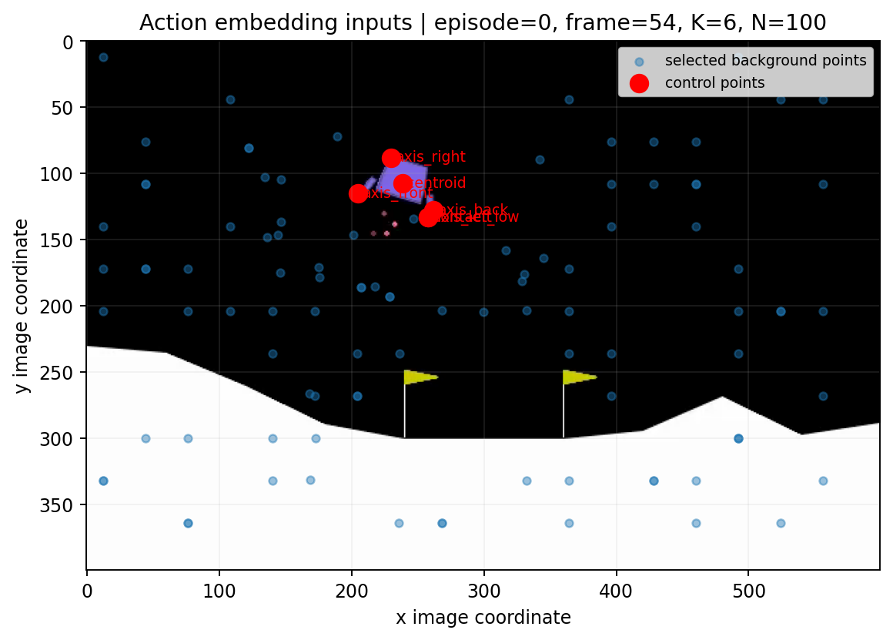

The next plot shows the actual action embedding matrices. `A_x` stores CP/background x-relations and `A_y` stores CP/background y-relations. These two matrices are stacked into one action token.

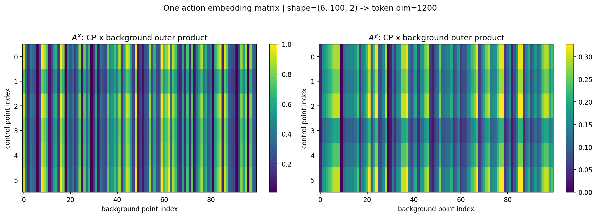

Across time, each frame becomes one action token. The transformer sees a sequence of these tokens exactly like a language model sees a sequence of token embeddings, except here the tokens are motion relations instead of words.

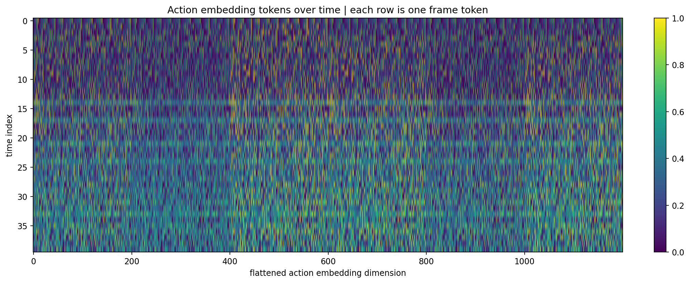

The temporal-change plot is the key sanity check. The action embedding does not vanish into a flat latent vector. It changes frame by frame, giving the model a measurable motion signal.

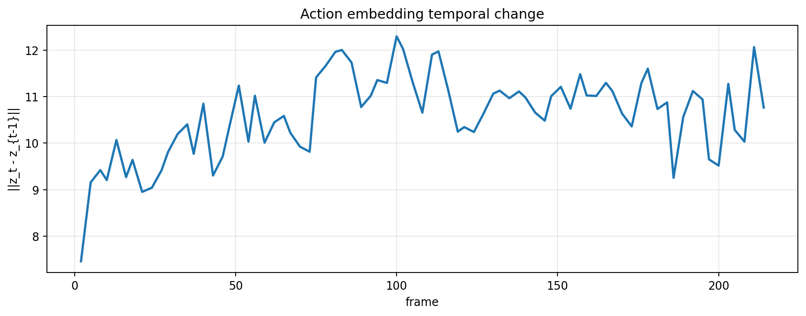

## Pretraining

Pretraining learns the temporal dynamics of action embeddings. The model is not yet learning the Lunar Lander action space. It is learning how CP/background relation tokens evolve over time.

The pretraining task is:

```text
z_{t-L+1}, ..., z_t -> z_{t+1}
```

where `z_t = flatten(A_t_norm)`.

In words: given a short history of action embeddings, predict the next action embedding.

```text
T_theta(z_{t-L+1:t}) = z_{t+1}^{pred}
loss = MSE(z_{t+1}^{pred}, z_{t+1}^{true})
```

This is the useful research result of the branch: the transformer can learn motion-token dynamics from the action embedding representation.

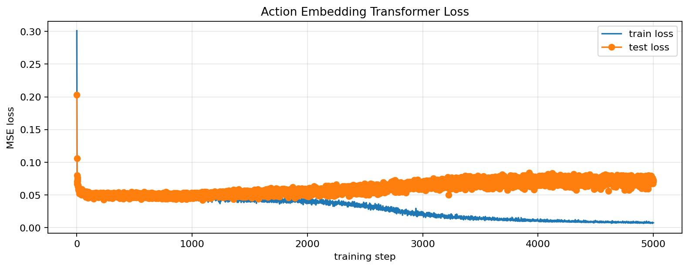

The flattened true-vs-predicted embedding plot shows that the transformer is not only predicting a mean vector. It is learning part of the high-dimensional relation structure.

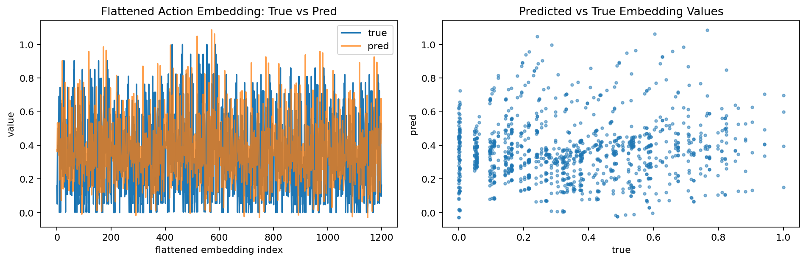

The spatial prediction view reconstructs an approximate CP/background view from the predicted token. It is not a perfect inverse, but it confirms that the predicted token stays close to the true next relation.

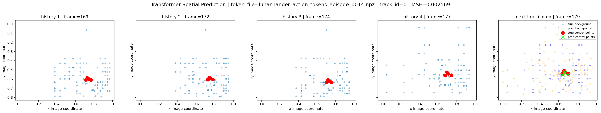

## Why This Matters

The earlier LSTM + autoencoder path could predict future encoded frames and reconstruct decoded frames, but frame-level latent states did not contain enough explicit action information. The action often vanished into generic visual prediction.

The CP/background relation changes the target. The model no longer predicts pixels first. It predicts structured motion:

```text
object control points relative to selected background points
```

That makes the representation closer to what an action actually is: a controlled change in object-background relation.

## Fine-Tuning Status

The unresolved problem is action grounding: mapping a learned action embedding into an executable action interface.

For Lunar Lander, the action space is:

```text
0: noop
1: left_engine
2: main_engine
3: right_engine
```

The tested fine-tune direction was an Action Inference Net:

```text
predicted action embedding -> action logits
```

Because there are no direct expert action labels in the video-only setting, we tested a re-environment benchmark. For each candidate action, the environment is replayed, the candidate action is applied, the resulting frame is encoded back into CP/background space, and the candidate whose consequence is closest to the reference relation is treated as the benchmark action.

This produced signal, but it also exposed the main bottleneck: many candidate actions create very similar short-horizon CP/background deltas. The benchmark often has low margin, so the best action is weakly identified.

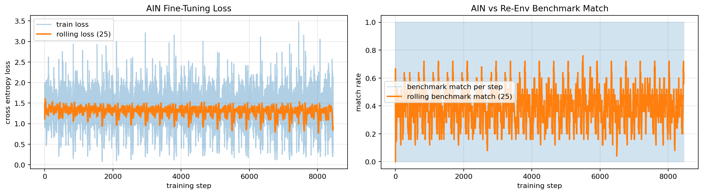

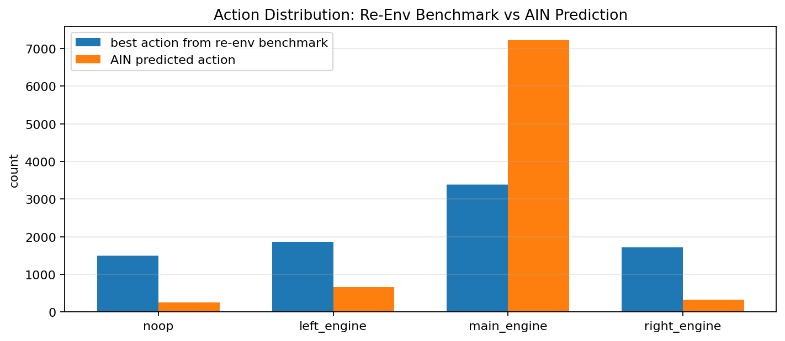

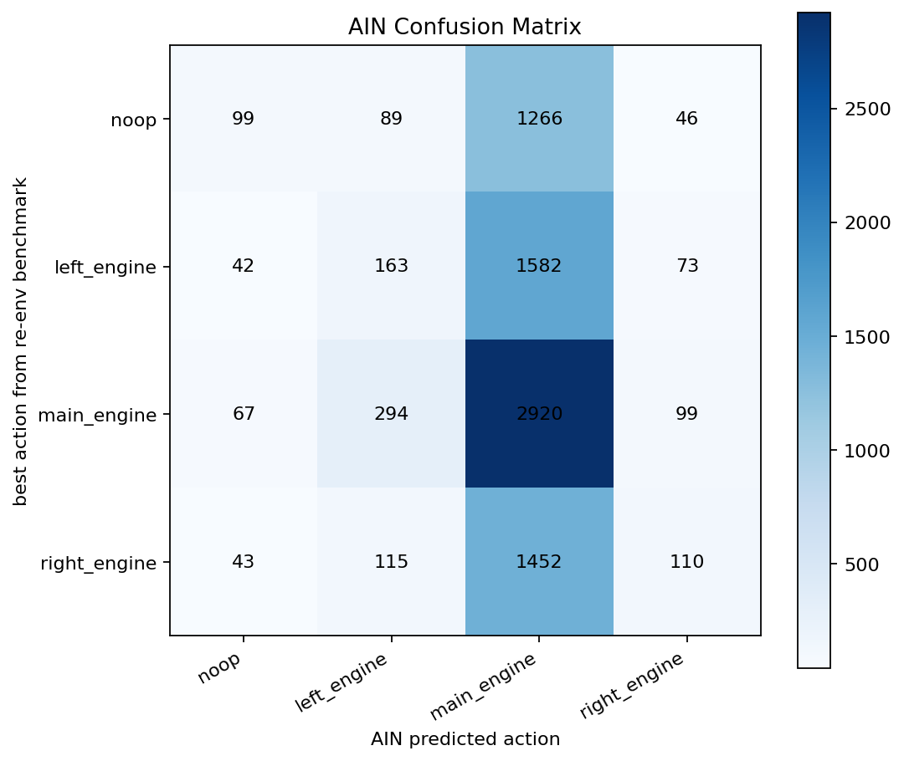

The candidate margin plot shows the problem directly: most candidate losses are extremely close. This means the action-grounding label is often low-confidence even when the pretraining representation is useful.

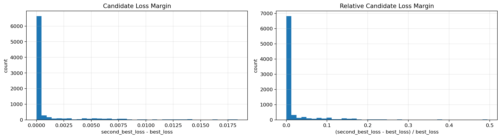

## Current Conclusion

The action embedding pretrain is promising. The action-space fine-tune is not solved yet.

What works:

- Lunar Lander control points are extracted from segmentation geometry.
- Background points are tracked and reduced to fixed `N = 100`.
- CP/background outer products produce a stable action token of dimension `1200`.
- A causal transformer learns to predict the next action embedding.
- The representation carries temporal motion signal.

What remains open:

- Mapping action embeddings to executable action spaces.
- Increasing action separation when candidate actions have very similar short-horizon effects.
- Adding stronger spatial structure instead of flattening too early.
- Testing pretrained visual or semantic models as a bridge from motion embedding to action concept.

## Next Research Direction

The next branch should focus on action-space grounding, not rebuilding object detection.

Practical next steps:

1. Keep the CP/background action embedding pretrain.
2. Add explicit spatial embeddings for control-point index, background-point index, relation channel, and time.
3. Test longer action-effect horizons and frame stride so action consequences are more separable.
4. Filter or downweight low-margin candidate actions.
5. Try a pretrained semantic bridge: map motion embeddings into concepts like `move_left`, `move_right`, `stabilize`, `fire_main_engine`, then map concepts into an agent-specific action space.
6. For environments with simulators, use teacher-forced re-env grounding instead of closed-loop rollout from an untrained policy.

## Repository Layout

```text
src/
  pretraining/      # modular action-embedding pretraining pipeline

notebooks/
  Action_Inference_Experiments_Object_and_Background_Segmentation_Model_Selection.ipynb
  Action_Inference_Experiments_LunarLander_Single_Episode_Action_Encoder_on_Transformer.ipynb
  Action_inference_Experiments_LunarLander_Pretraining.ipynb
  Action_Inference_Experiments_LunarLander_FineTune.ipynb

artifacts/
  raw_videos/      # source videos used by research and pretraining
  research/        # exploratory notebook outputs
  pretrain/        # generated pretraining datasets, plots, logs, and models

lunarlander_expert/
  # expert policy/video generation code for Lunar Lander
```

Large generated files are intentionally ignored by git. The repository should track code, notebooks, documentation, and lightweight plot assets, not multi-GB CSV/video artifacts.

## Pretraining Pipeline

Run the modular pretraining pipeline from the project root:

```bash
python -m src.pretraining.run_control_points
python -m src.pretraining.run_background_points
python -m src.pretraining.run_action_embeddings
python -m src.pretraining.run_pretrain_transformer
```

The pipeline writes outputs to:

```text
artifacts/pretrain/
  control_points/
  background_points/
  action_embeddings/
  tokens/
  models/
  plots/
  logs/
  reviews/
```

## Hypothesis

An action is not just a label. An action is a structured transformation of an object relative to its environment. If that transformation can be encoded as a reusable action embedding, then pretraining can learn motion before any specific robot action space is attached.
