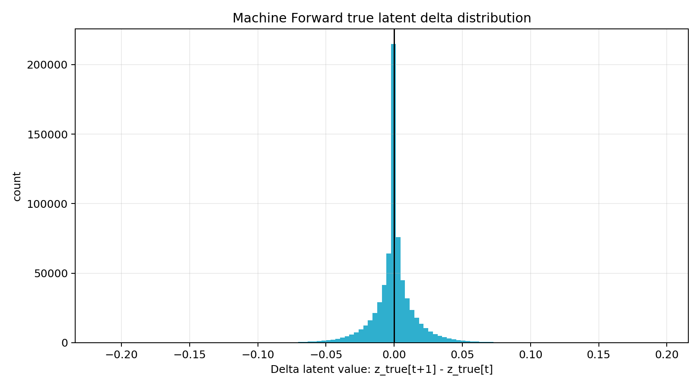

# Experiment 001 - Machine Forward True Delta Bottleneck

## Plot

## Step

`machine_forward_08_true_delta`

## What Was Checked

`MachineForward` learns:

$$\Delta z_{t+1}^{true} = z_{t+1}^{true} - z_t^{true}$$

The TensorBoard histogram and direct probe dataset stats show that most true latent deltas are very close to zero.

## Observed Stats

* shape: `(10952, 64)`
* mean: `0.000000097`
* std: `0.016482`
* abs mean: `0.009892`
* mean vector norm: `0.100751`
* min: `-0.213402`
* max: `0.195319`

## Conclusion

First bottleneck found: the one-step latent transition is probably too small to strongly infer action.

`MachineForward` is learning, because test loss beats zero baseline, but the target is weak:

$$\Delta z_{t+1}^{true} \approx 0$$

This can explain why runtime control later selects actions close to zero.

## Next Hypothesis

Increase temporal stride in Machine Forward dataset creation:

$$\Delta z_{t+s}^{true} = z_{t+s}^{true} - z_t^{true}$$

Expected effect: larger latent delta, stronger action signal, better runtime action search.

## Next Run

`002_machine_stride`
