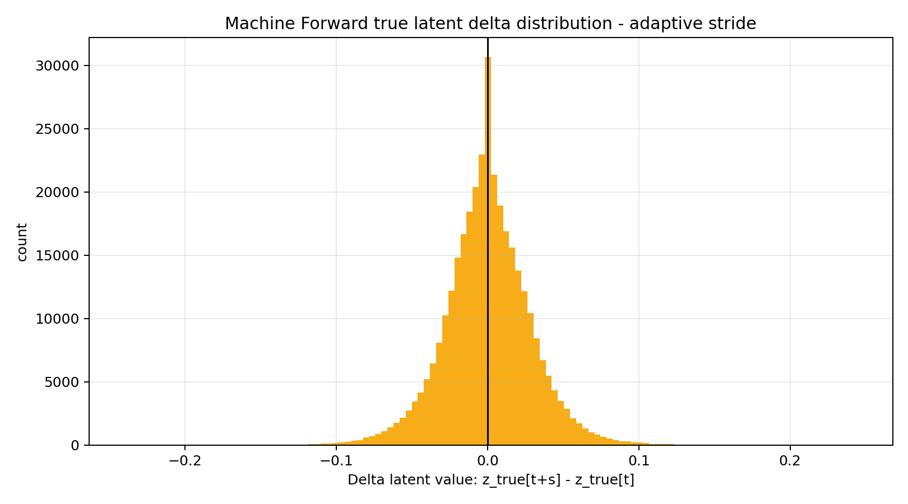

# Experiment 002 - Machine Forward Adaptive Stride

## Plot

## Problem From Run 001

`machine_forward_08_true_delta` was too close to zero:

$$\Delta z_{t+1}^{true} = z_{t+1}^{true} - z_t^{true} \approx 0$$

This made the action signal weak and likely pushed runtime control toward near-zero actions.

## Change

Machine Forward dataset now uses adaptive latent-motion stride:

$$\Delta z_{t+s}^{true} = z_{t+s}^{true} - z_t^{true}$$

where `s` increases until latent motion crosses `min_delta_norm` or reaches `max_stride`.

## Observed Stats

Run 001:

* std: `0.016482`
* abs mean: `0.009892`
* mean vector norm: `0.100751`

Run 002:

* shape: `(5279, 64)`
* std: `0.028372`
* abs mean: `0.021123`
* mean vector norm: `0.215358`
* stride mean: `1.912294`
* stride min: `1.0`
* stride max: `8.0`

## Conclusion

Problem improved: adaptive stride makes the true latent delta wider and stronger.

This does not prove runtime control is fixed yet, but it removes the first upstream bottleneck found in `machine_forward_08_true_delta`.

## Next Check

Continue run 002 analysis from:

* `machine_forward_09_pred_delta`
* `machine_forward/delta_cos`
* `loss/test`
* `loss/zero_baseline`
* `machine_forward/zero_over_machine`
